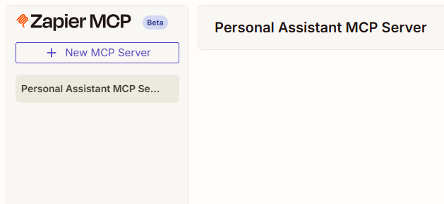
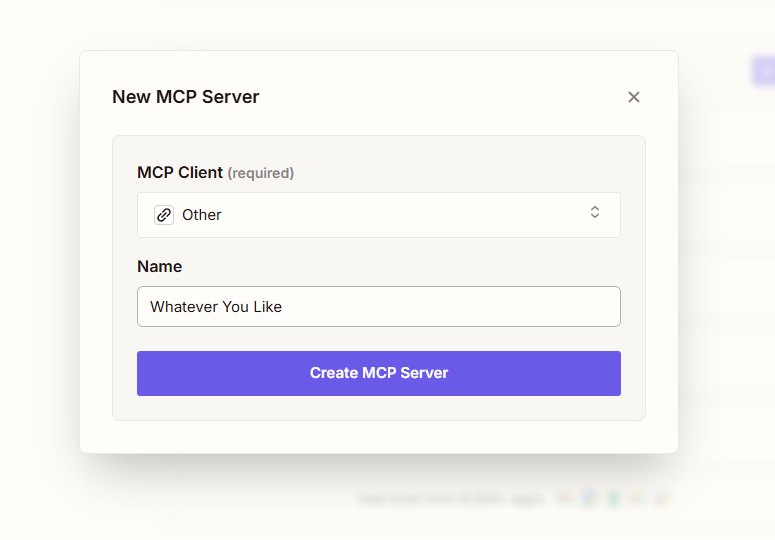
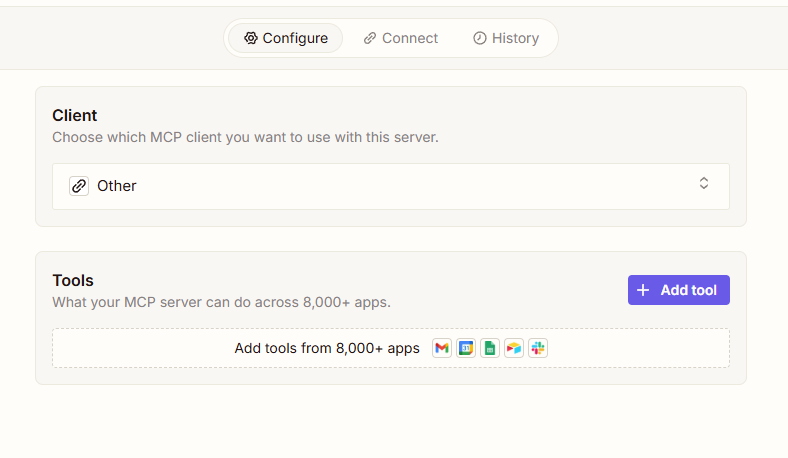
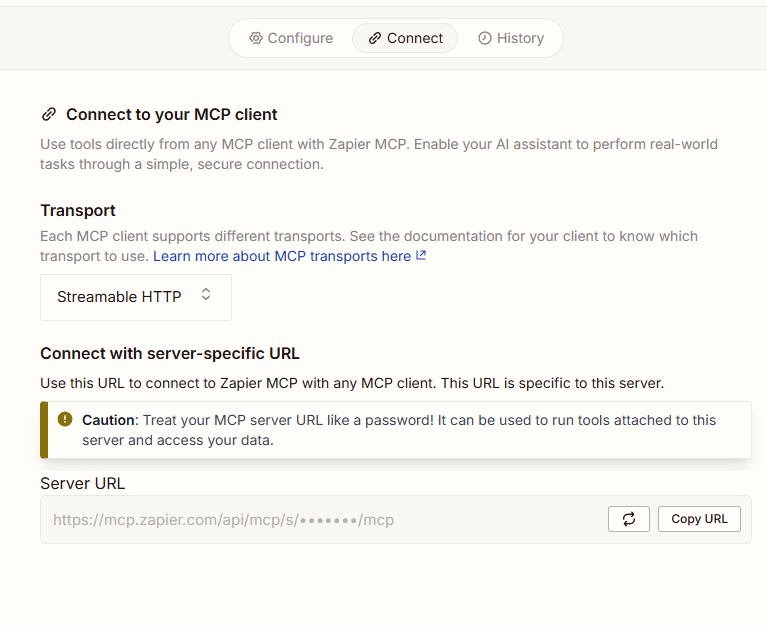

Now that you understand how to implement human-in-the-loop interactions, it's time to give your agent access to actually useful tools. The most straightforward approach is to code tools directly into your `getTools()` function. This gives you complete control, but it's time-consuming.

There's a faster way to prototype and validate tool behavior: MCP servers. Specifically, the [Zapier MCP server](https://zapier.com/mcp) acts as a gateway to thousands of pre-built integrations. Instead of writing code, you can browse Zapier's service catalog and instantly add tools like Google Tasks, Google Calendar, and Google Docs to your agent.

The Zapier MCP server has a just-generous-enough free trial (50 invocations per month), making it perfect for testing how external services behave with your personal assistant before committing to custom implementations.

### Steps To Complete

#### Setting up your Zapier MCP Server

- [ ] Sign up for a Zapier account

1. Head to the [Zapier homepage](https://zapier.com/) and sign up for a free account.

2. Walk through the signup process.

3. Go to the [Zapier MCP site](https://mcp.zapier.com/).

4. Press the "Create New Server" button in the top-left:



5. Choose "Other" as the MCP Client, and choose a name:



6. Press the 'connect' button in the Nav bar



7. Keep the transport on 'Streamable HTTP' and copy the Server URL



8. Store your Zapier MCP URL as an environment variable so your agent can connect to it.

```env
ZAPIER_MCP_URL=your_mcp_url_here
```

## Hooking up the Zapier MCP

<!-- VIDEO -->

Let's integrate the Zapier MCP server with our agent so it can access external tools and services.

### Steps To Complete

#### Adding the `@ai-sdk/mcp` package

- [ ] Add the `@ai-sdk/mcp` package to your project dependencies

```bash
pnpm add @ai-sdk/mcp@^0.0.8
```

#### Creating the `getMCPTools` function

- [ ] Create a new file `src/app/api/chat/mcp.ts` with a function that connects to your MCP server and retrieves available tools

<Spoiler>

```typescript
// src/app/api/chat/mcp.ts
import { experimental_createMCPClient } from '@ai-sdk/mcp';

export const getMCPTools = async () => {
  // ADDED: Create HTTP client to connect to MCP server
  const httpClient = await experimental_createMCPClient({
    transport: {
      type: 'http',
      url: process.env.MCP_URL!,
    },
  });

  // ADDED: Fetch available tools from the MCP server
  const tools = await httpClient.tools();

  return tools;
};
```

</Spoiler>

#### Updating the agent to accept MCP tools

- [ ] Import `ToolSet` from the `ai` package in `src/app/api/chat/agent.ts`

```typescript
import {
  Experimental_Agent as Agent,
  LanguageModel,
  StopCondition,
  ToolSet, // ADDED: Import ToolSet from ai
  UIMessage,
} from 'ai';
```

- [ ] Add `mcpTools` parameter to the `createAgent` options object and merge it with the in-code tools

<Spoiler>

```typescript
// src/app/api/chat/agent.ts
export const createAgent = (opts: {
  messages: MyMessage[];
  model: LanguageModel;
  stopWhen: StopCondition<any>;
  memories: DB.Memory[];
  relatedChats: DB.Chat[];
  mcpTools: ToolSet; // ADDED: Accept MCP tools
}) =>
  new Agent({
    model: opts.model,
    // CHANGED: Merge both in-code tools and MCP tools
    tools: { ...getTools(opts.messages), ...opts.mcpTools },
    stopWhen: opts.stopWhen,
    system: `...`,
  });
```

</Spoiler>

#### Passing MCP tools to the agent in the chat route

- [ ] Import `getMCPTools` in `src/app/api/chat/route.ts`

```typescript
import { getMCPTools } from './mcp';
```

- [ ] Call `getMCPTools()` and pass the result to `createAgent` in the `POST` handler

<Spoiler>

```typescript
// src/app/api/chat/route.ts
const stream = createUIMessageStream<MyMessage>({
  execute: async ({ writer }) => {
    // ... existing code ...

    const relatedChats = await searchForRelatedChats(
      chatId,
      messages,
    );

    // ADDED: Fetch MCP tools from the server
    const mcpTools = await getMCPTools();

    const agent = createAgent({
      memories: memories.map((memory) => memory.item),
      relatedChats: relatedChats.map((chat) => chat.item),
      messages: messageHistoryForLLM,
      model: google('gemini-2.5-flash'),
      stopWhen: stepCountIs(10),
      mcpTools, // ADDED: Pass MCP tools to agent
    });

    // ... rest of code ...
  },
  // ...
});
```

</Spoiler>

#### Stubbing MCP tools in tests

- [ ] Update `evals/e2e-retrieval.eval.ts` to pass an empty `mcpTools` object to `createAgent` so tests don't call external MCP services

<Spoiler>

```typescript
// evals/e2e-retrieval.eval.ts
task: async (input, model) => {
  const agent = createAgent({
    memories: [],
    messages: input,
    model: model,
    stopWhen: stepCountIs(10),
    relatedChats: [],
    mcpTools: {}, // ADDED: Empty object prevents external MCP calls during tests
  });

  // ... rest of code ...
};
```

</Spoiler>

#### Testing the integration

- [ ] Run your development server to test the MCP integration

```bash
pnpm dev
```

- [ ] Try asking the agent to perform a task that uses the Zapier MCP tools, like "remind me to take my cat to the vet tomorrow". The agent should use the MCP tools to create the task!

## Removing Unwanted Tools

<!-- VIDEO -->

We're going to clean up the MCP tools by removing `add_tools` and `edit_tools`, which we don't want our agent to use. We'll also add logging to see what tools are available.

### Steps To Complete

#### Creating the `deleteUnwantedTools` function

- [ ] Add the `ToolSet` import from the `ai` package to `src/app/api/chat/mcp.ts`

```typescript
import { ToolSet } from 'ai';
```

- [ ] Create a `deleteUnwantedTools` function that removes the `add_tools` and `edit_tools` from the tools object. These tools let the agent modify the MCP server itself, which we don't want to allow.

<Spoiler>

```typescript
const deleteUnwantedTools = (tools: ToolSet) => {
  if ('add_tools' in tools) {
    delete tools.add_tools;
  }
  if ('edit_tools' in tools) {
    delete tools.edit_tools;
  }

  return tools;
};
```

</Spoiler>

#### Adding tool logging and cleanup

- [ ] In the `getMCPTools` function, add a loop that logs each tool name and its input schema. This helps us understand what tools are consuming tokens in the system prompt.

<Spoiler>

```typescript
export const getMCPTools = async () => {
  const httpClient = await experimental_createMCPClient({
    transport: {
      type: 'http',
      url: process.env.MCP_URL!,
    },
  });

  const tools = await httpClient.tools();

  // ADDED: Log all tools and their schemas for debugging
  for (const tool of Object.keys(tools)) {
    console.log(
      tool,
      (tools[tool].inputSchema as any).jsonSchema,
    );
  }

  // CHANGED: Filter unwanted tools before returning
  return deleteUnwantedTools(tools);
};
```

</Spoiler>

## Adding Local Definitions

<!-- VIDEO -->

Let's add local type-safe schema definitions for the MCP tools to enable better control and token optimization.

### Steps To Complete

#### Understanding Local Schema Definitions

- [ ] Recognize that you can pass Zod schemas to `httpclient.tools()` to define tool inputs locally. This provides type safety, autocomplete, and the ability to remove unnecessary fields to save tokens.

#### Removing the Logging Code

- [ ] Remove the logging loop that prints tool schemas to the console. We no longer need this now that we're defining schemas locally.

<Spoiler>

```typescript
// src/app/api/chat/mcp.ts

export const getMCPTools = async () => {
  const httpClient = await experimental_createMCPClient({
    transport: {
      type: 'http',
      url: process.env.MCP_URL!,
    },
  });

  const tools = await httpClient.tools();

  // DELETED: Removed logging loop
  // for (const tool of Object.keys(tools)) {
  //   console.log(tool, (tools[tool].inputSchema as any).jsonSchema);
  // }

  return deleteUnwantedTools(tools);
};
```

</Spoiler>

#### Adding Schema Comments as Documentation

- [ ] Add a commented-out block at the bottom of the file showing example local schema definitions using Zod. These demonstrate how to define schemas locally for each tool (like `google_calendar_find_events`, `google_docs_find_a_document`, etc.).

<Spoiler>

```typescript
// src/app/api/chat/mcp.ts

// ADDED: Local schema definitions (commented out as reference)
// {
//   schemas: {
//     google_calendar_find_events: {
//       inputSchema: z
//         .object({
//           instructions: z
//             .string()
//             .describe(
//               "Instructions for running this tool. Any parameters that are not given a value will be guessed based on the instructions."
//             ),
//           end_time: z
//             .string()
//             .optional()
//             .describe("..."),
//           // ... additional fields
//         })
//         .strict(),
//     },
//     // ... other tool schemas
//   },
// }
```

</Spoiler>

#### Understanding the Benefits

- [ ] Note that these local definitions allow you to: remove optional fields you don't need (saving tokens), get full type safety with autocomplete, and control which options the AI has available. For production use, you would uncomment and customize these schemas to match your needs.
